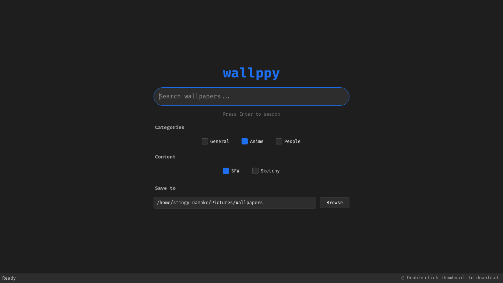
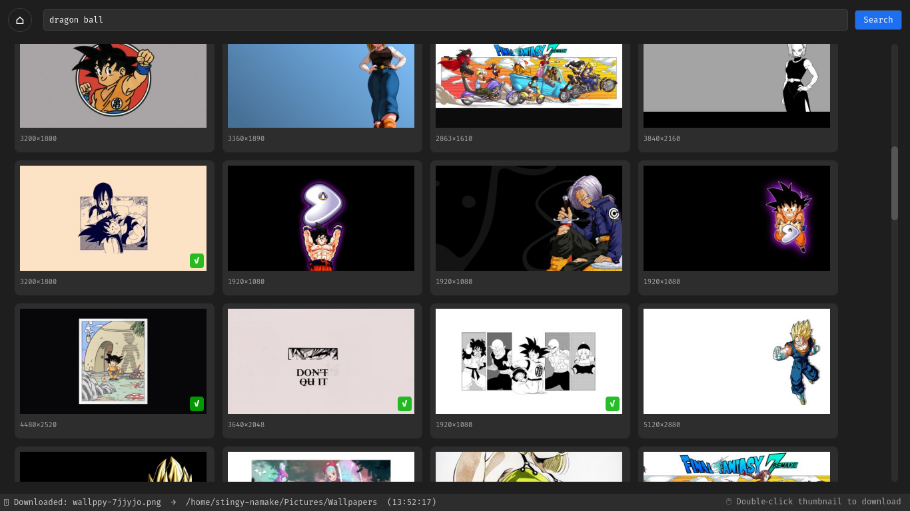

## Project Description (short)

**wallppy** is a modern, minimal desktop wallpaper browser built with Python and PyQt5. It taps into the Wallhaven API to let you search, scroll infinitely, and download wallpapers with a double-click. The interface features a dark theme, thumbnail previews with resolution info, and persistent download tracking – downloaded wallpapers get a green checkmark overlay. Settings like download folder, content categories, and SFW/sketchy filters are saved automatically.

---

## README

# wallppy 🖼️

> Modern, minimal wallpaper browser with infinite scrolling and one‑double‑click downloads.




wallppy is a desktop application that turns [Wallhaven](https://wallhaven.cc/) (kudos to them) into a sleek, keyboard‑friendly wallpaper explorer. Search any keyword, scroll endlessly through thumbnails, and double‑click any image to save it to your local folder. Already downloaded wallpapers are marked with a green ✓.

## ✨ Features

- **Infinite scrolling** – automatically loads more wallpapers as you reach the bottom.
- **Double‑click to download** – saves the full‑resolution wallpaper.
- **Download tracking** – a checkmark appears on thumbnails that are already on your disk.
- **Search & filters** – categories (General, Anime, People) and content filters (SFW, Sketchy).
- **Persistent settings** – download folder, category preferences, and purity options are saved in `~/.config/wallppy/settings.json`.
- **Dark theme** – easy on the eyes, with a clean monospace font.
- **Landing page** – a focused search start screen with folder picker.
- **Status bar** – shows download progress and current search state.

## 📦 Requirements

- Python 3.8 or higher
- PyQt5
- `requests`

## 🔧 Installation

1. **Clone or download** this repository.
2. **Install dependencies**:
   ```bash
   pip install pyqt5 requests
   ```
3. **Run the application**:
   ```bash
   python wallppy_gui.py
   ```

> **Note**: Wallhaven’s public API does not require an API key for search, but anonymous or NSFW requests are rate‑limited. For heavy use you may want to add your API key by editing the `API_URL` parameters (not required for basic usage).

## 🚀 Usage

1. Launch the app – you’ll see the landing page.
2. Type a search query (e.g., `cyberpunk`, `nature`, `anime landscape`) and press **Enter**.
3. Browse the thumbnails – scroll down to load more.
4. **Double‑click** any thumbnail to download the full image.
5. Downloaded wallpapers show a green ✓ in the bottom‑right corner of the thumbnail.
6. Use the **⌂ home button** to return to the landing page and change filters or download folder.

### Keyboard shortcuts

| Action | Key |
|--------|-----|
| Search (on landing page) | `Enter` |
| Search (on results page) | `Enter` (in search box) |

### Customising the download folder

- On the landing page, click **Browse** and select any folder.
- The path is saved automatically – all future downloads go there.

## ⚙️ Configuration

Settings are stored in `~/.config/wallppy/settings.json` (Linux/macOS) or `%USERPROFILE%\.config\wallppy\settings.json` (Windows). Example:

```json
{
  "download_folder": "./wallpapers",
  "categories": {
    "general": true,
    "anime": true,
    "people": true
  },
  "purity": {
    "sfw": true,
    "sketchy": false
  }
}
```

You can edit this file manually while the app is closed.

## 🧩 How it works

- **Search API**: `https://wallhaven.cc/api/v1/search` with parameters for query, categories, purity, sorting, and pagination.
- **Thumbnails**: loaded asynchronously in background threads so the UI stays responsive.
- **Downloads**: streamed in chunks with a progress bar on the status bar.
- **Infinite scroll**: triggers next page when the vertical scrollbar is within 200 pixels of the bottom.

## 📝 Notes

- Only JPG and PNG images are supported (Wallhaven’s most common formats).
- The app creates the download folder automatically if it doesn’t exist.
- Double‑clicking a wallpaper that is already downloaded will re‑download it (overwrites the existing file).
- The green checkmark only appears after a successful download and persists across sessions.